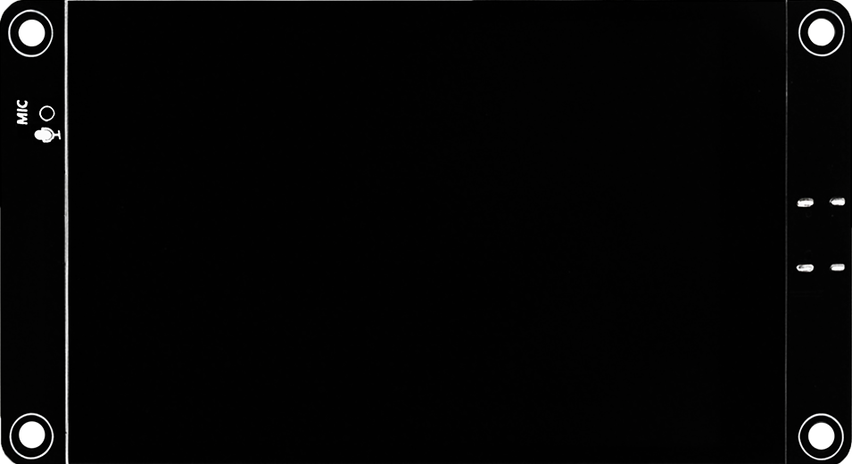
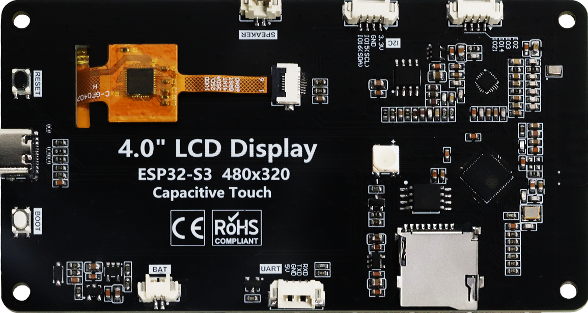
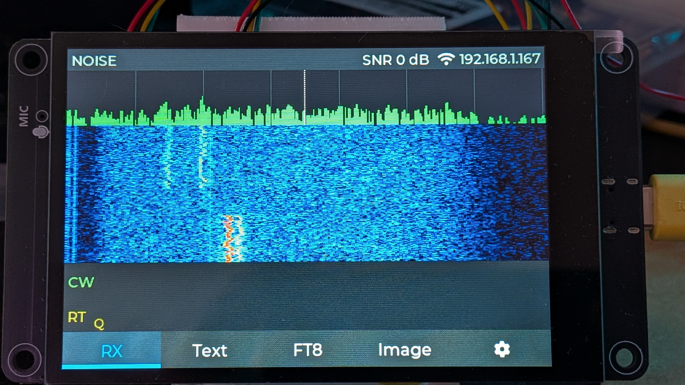
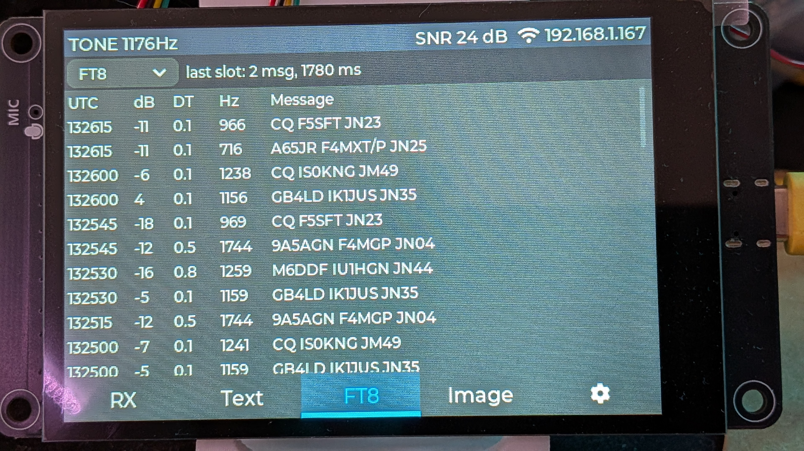
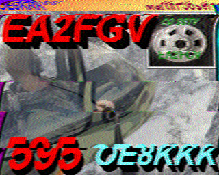
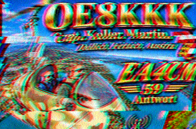

# RX Analyzer

**🇵🇹 [Português](#-português) · 🇬🇧 [English](#-english)**

<p align="center">
  
  
</p>

---

## 🇵🇹 Português

Descodificador/analisador de sinais de rádio **autónomo**, baseado em ESP32-S3. Liga-se à saída de áudio de um rádio (HF/VHF), analisa o espetro e descodifica o sinal sem precisar de PC.

### O que faz

- **Espectro e waterfall** em tempo real, com deteção e classificação automática do sinal (ruído, tom, CW, RTTY/FSK, PSK31, voz), por heurística e por um modelo **TinyML** (MLP int8) a correr na própria placa.
- **CW (Morse)** e **RTTY** (Baudot, 45,45 / 50 / 75 baud), com estimativa de WPM, AFC e polaridade automática.
- **PSK31 / PSK63 / PSK125** (BPSK, Varicode), com deteção automática da velocidade e do centro do sinal, e AFC.
- **NAVTEX / SITOR-B** (100 baud, CCIR 476 com FEC), com polaridade e sincronismo automáticos.
- **Feld-Hell**: o texto "desenhado" pelo tom, em colunas, no LCD e na página web.
- **APRS / AX.25 a 1200 baud** (AFSK), a partir do áudio de um recetor FM; só mostra tramas com CRC válido.
- **DTMF**, **CTCSS** (subtons de 67,0 a 254,1 Hz) e **DCS**; o CTCSS e o DCS precisam de áudio abaixo de 300 Hz (saída de linha ou do discriminador).
- **POCSAG** 512 / 1200 / 2400 baud (pagers), com correção BCH; pode ser desligado no `config.h` (`POCSAG_ENABLE`), porque receber mensagens de terceiros pode ser proibido por lei.
- **FAX meteorológico (WEFAX)** e **SSTV** (Martin, Scottie, Robot, PD), com imagens apresentadas ao vivo. O FAX tem squelch, filtro de mediana, seguimento do período da linha e resincronização em saltos do sinal.
- **FT8 / FT4**, com a biblioteca [ft8_lib](components/ft8_lib/README.md) (MIT).
- **Ecrã LCD com touch** de 4" (interface em português e inglês) e, opcionalmente, uma **página web** por Wi-Fi com os mesmos dados.

### Hardware

| Placa | Notas |
|---|---|
| **Freenove FNK0104S** (placa principal) | ESP32-S3R8 (8 MB PSRAM), 16 MB flash, LCD 4" 480×320 (ST7796) com touch capacitivo (FT6336U), codec ES8311, cartão SD, bateria, USB-C. [Esquema](docs/4.0inch_ESP32-S3_Display_Schematic.pdf) |
| **ESP32-S3 DevKitC-1 N16R8** (alternativa) | Sem LCD; usa-se só a página web. |

Por omissão, a entrada de áudio usa o **ADC interno** do ESP32-S3 (GPIO2 na Freenove, header P3 pino 1; GPIO1 na DevKitC), com um circuito simples de polarização. Na Freenove também se pode usar o **codec ES8311** como entrada (ambiente `freenove-fnk0104s-es8311`, exige alterações na placa), e o áudio recebido ouve-se sempre no **altifalante** da placa, com volume regulável:

| Componente | Ligação |
|---|---|
| C1 1 µF | áudio in → GPIO de entrada |
| R1 10 kΩ | 3V3 → GPIO de entrada |
| R2 10 kΩ | GPIO de entrada → GND |

Máximo ~2,8 Vpp. **Não ligues uma saída de rádio desconhecida diretamente**; começa com uma fonte de baixo nível. Detalhes em [docs/HARDWARE.md](docs/HARDWARE.md).

### Ecrã

<p align="center">
  
  
</p>

### Exemplos de imagens recebidas (SSTV)

<p align="center">
  
  
</p>

### Compilar e gravar

Requer [PlatformIO](https://platformio.org/).

```text
pio run -t upload                              # Freenove FNK0104S (por omissão)
pio run -e esp32-s3-devkitc-1 -t upload        # DevKitC
pio device monitor
```

Se a Freenove não aparecer no PC: carrega em **BOOT**, carrega e larga **RESET**, e larga **BOOT**.

Na Freenove, o Wi-Fi configura-se no próprio ecrã: **⚙ → Redes Wi-Fi...**, escolhes a rede e escreves a password no teclado do ecrã. Depois a página web fica em `http://<endereço mostrado no ecrã>/`. Na DevKitC (sem ecrã), no primeiro arranque liga-te à rede **`RX-Analyzer`** (password `rxanalyzer`), abre `http://192.168.4.1/` e escolhe aí a tua rede; muda esta password se deixares a placa ligada.

### Estado do projeto

Em desenvolvimento. Validado com gravações e simuladores no PC e com alguns sinais reais; a validação completa com o rádio, a gravação em SD e a caixa ainda estão por fazer. A entrada pelo ES8311 e o monitor no altifalante estão implementados, mas por validar com o rádio.

### Documentação

- [docs/DETALHES.md](docs/DETALHES.md) — descrição técnica completa, ecrã, interface web, TinyML, roadmap e estrutura do código
- [docs/HARDWARE.md](docs/HARDWARE.md) — ligações e GPIOs
- [docs/TEST_PLAN.md](docs/TEST_PLAN.md) — plano de testes

---

## 🇬🇧 English

A **standalone** radio signal decoder/analyzer built on the ESP32-S3. It connects to the audio output of a radio (HF/VHF), analyzes the spectrum and decodes the signal with no PC required.

### Features

- Real-time **spectrum and waterfall**, with automatic signal detection and classification (noise, tone, CW, RTTY/FSK, PSK31, voice), using both heuristics and an on-device **TinyML** model (int8 MLP).
- **CW (Morse)** and **RTTY** (Baudot, 45.45 / 50 / 75 baud), with WPM estimation, AFC and automatic polarity.
- **PSK31 / PSK63 / PSK125** (BPSK, Varicode), with automatic speed and centre detection, and AFC.
- **NAVTEX / SITOR-B** (100 baud, CCIR 476 with FEC), with automatic polarity and sync.
- **Feld-Hell**: the text "painted" by the tone, in columns, on the LCD and the web page.
- **APRS / AX.25 at 1200 baud** (AFSK), from the audio of an FM receiver; only frames with a valid CRC are shown.
- **DTMF**, **CTCSS** (67.0 to 254.1 Hz sub-tones) and **DCS**; CTCSS and DCS need audio below 300 Hz (line or discriminator output).
- **POCSAG** 512 / 1200 / 2400 baud (pagers), with BCH correction; can be left out in `config.h` (`POCSAG_ENABLE`), as receiving third-party messages may be illegal.
- **Weather FAX (WEFAX)** and **SSTV** (Martin, Scottie, Robot, PD), with live image display. FAX has squelch, noise median filtering, line-length tracking and resync after signal jumps.
- **FT8 / FT4**, using the [ft8_lib](components/ft8_lib/README.md) library (MIT).
- **4" touch LCD** (Portuguese and English UI) and, optionally, a **web page** over Wi-Fi showing the same data.

### Hardware

| Board | Notes |
|---|---|
| **Freenove FNK0104S** (main board) | ESP32-S3R8 (8 MB PSRAM), 16 MB flash, 4" 480×320 LCD (ST7796) with capacitive touch (FT6336U), ES8311 codec, SD card, battery, USB-C. [Schematic](docs/4.0inch_ESP32-S3_Display_Schematic.pdf) |
| **ESP32-S3 DevKitC-1 N16R8** (alternative) | No LCD; web page only. |

By default, audio input uses the ESP32-S3 **internal ADC** (GPIO2 on the Freenove, header P3 pin 1; GPIO1 on the DevKitC) with a simple biasing network. On the Freenove the **ES8311 codec** can be used as the input instead (`freenove-fnk0104s-es8311` environment, needs board modifications), and the received audio can always be heard on the board's **speaker** with an adjustable volume:

| Part | Connection |
|---|---|
| C1 1 µF | audio in → input GPIO |
| R1 10 kΩ | 3V3 → input GPIO |
| R2 10 kΩ | input GPIO → GND |

Maximum ~2.8 Vpp. **Do not connect an unknown radio output directly**; start with a known low-level source. See [docs/HARDWARE.md](docs/HARDWARE.md) (in Portuguese).

### Display

<p align="center">
  
  
</p>

### Sample decoded images (SSTV)

<p align="center">
  
  
</p>

### Build and flash

Requires [PlatformIO](https://platformio.org/).

```text
pio run -t upload                              # Freenove FNK0104S (default)
pio run -e esp32-s3-devkitc-1 -t upload        # DevKitC
pio device monitor
```

If the Freenove isn't detected by the PC: hold **BOOT**, press and release **RESET**, then release **BOOT**.

On the Freenove, Wi-Fi is set up on the board itself: **⚙ → Wi-Fi networks...**, pick the network and type the password on the on-screen keyboard. The web page is then at `http://<address shown on the screen>/`. On the DevKitC (no display), on first boot join the **`RX-Analyzer`** network (password `rxanalyzer`), open `http://192.168.4.1/` and choose your network there; change this password if you leave the board running.

### Status

Work in progress. Validated with recordings and PC simulators and some real signals; full on-air validation, SD recording and the enclosure are still to do. ES8311 input and the speaker monitor are implemented but not yet validated with a radio.

### Documentation

Technical documentation is currently in Portuguese:

- [docs/DETALHES.md](docs/DETALHES.md) — full technical description, display, web UI, TinyML, roadmap and code layout
- [docs/HARDWARE.md](docs/HARDWARE.md) — wiring and GPIOs
- [docs/TEST_PLAN.md](docs/TEST_PLAN.md) — test plan

---

## Licença / License

[MIT](LICENSE). A `ft8_lib` em `components/` tem a sua própria licença MIT. / [MIT](LICENSE). `components/ft8_lib` has its own MIT license.
